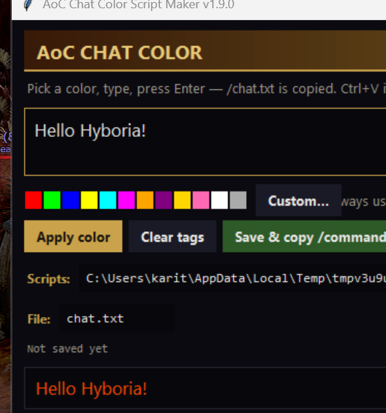

# Age of Conan: Unchained — The Beginning

Fan-made tribute site: the twelve classes, the island of Tortage, and a gallery of
original Hyborian artwork. A single self-contained `index.html` (no build, no
dependencies — all artwork inlined).

**Live site:** https://epicshovel.github.io/aoc-unchained/

Unofficial fan project. Age of Conan is a trademark of Funcom.

---

## AoC Chat Color Script Maker

A small Windows desktop helper for writing **colored chat messages in Age of Conan**
without memorizing the game's `` markup.

  
  

**What it does:**

- Pick one of 12 preset colors — or any custom color with the color dialog
- Type your message and see a **live preview** in the selected color
- **Apply color** to the highlighted part of the message (or the whole thing),
  **Clear tags** to strip all markup again
- Auto-color mode: everything you type is wrapped in the selected color automatically
- Saves the markup (single-quoted, the way AoC parses it) into the game's
  **Scripts** folder — auto-detected, or pick it with Browse
- The file name **is** the in-game command: saving `chat.txt` means you run it
  with `/chat.txt`
- Copies the `/chat.txt` command to your **clipboard** — in game: click the chat
  box, Ctrl+V, Enter
- Character counter with a warning for very long messages
- Remembers your Scripts folder, file name and color settings between runs
- Dark Hyborian-style UI with tooltips, always-on-top window

**Download:** grab `AoC_Chat_Color_Paster_v1.9.0.zip` from the
[Releases](https://github.com/EpicShovel/aoc-unchained/releases) page,
unzip anywhere, and run `AoC Chat Color Paster.exe`.

**Build from source:** `python aoc_chat_color_paster.py` (Python 3.8+, stdlib only),
or `build_chat_paster.bat` for the standalone exe (PyInstaller).
